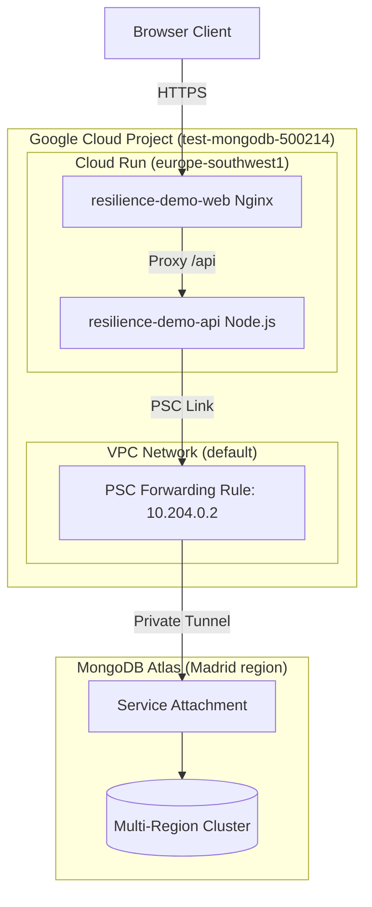

# MongoDB Atlas HA Resilience Demo — GCP Deployment Runbook

This runbook documents the complete end-to-end setup, troubleshooting steps, and architectural refactoring executed to deploy the MongoDB Atlas High Availability & Driver Resilience Demo on **Google Cloud Run** using **Private Service Connect (PSC)** for secure database networking.

---

## Architecture Overview

The deployed system consists of a secure, stateless full-stack application running in the Madrid region (`europe-southwest1`), connected privately to MongoDB Atlas:



---

## Detailed Implementation Steps

### Phase 1: Local `gcloud` Profile Setup
To isolate deployment credentials and target settings from global defaults, we created a dedicated named configuration profile:

```bash
# 1. Create and activate a clean profile
gcloud config configurations create ctti-deploy

# 2. Set active target account and project
gcloud config set account jvillamizar@google.com
gcloud config set project test-mongodb-500214
```

---

### Phase 2: Private Service Connect (PSC) Configuration
To link the GCP VPC network securely to MongoDB Atlas in the same region (`europe-southwest1`):

1. **Enable Compute API**:
   ```bash
   gcloud services enable compute.googleapis.com
   ```
2. **Reserve Private IP Address**:
   Reserves an IP address in the `default` subnet of the `default` VPC:
   ```bash
   gcloud compute addresses create hackathon-ctti-gcp-ip \
       --region=europe-southwest1 \
       --subnet=default \
       --project=test-mongodb-500214
   ```
   *Resulting IP:* `10.204.0.2` (This IP acts as a secure, local "alias" for the MongoDB Atlas cluster inside your private VPC network, completely bypassing the public internet).

3. **Create the Forwarding Rule**:
   Connects the reserved private IP to the Atlas Service Attachment:
   ```bash
   gcloud compute forwarding-rules create hackathon-ctti-gcp-endpoint \
       --region=europe-southwest1 \
       --address=hackathon-ctti-gcp-ip \
       --target-service-attachment=projects/p-hzilahdb321ncnuzkcqbot7b/regions/europe-southwest1/serviceAttachments/sa-europe-southwest1-6a35220c3e6bb999e346b14d \
       --network=default \
       --project=test-mongodb-500214
   ```

---

### Phase 3: Architectural & Code Enhancements

To make the default application suitable for a containerized, serverless cloud environment (Cloud Run), two major refactorings were implemented:

#### 1. Non-Blocking Backend Startup (`apps/api/src/index.ts`)
*   **The Problem:** The default application connected to MongoDB and started change streams *before* starting the Express server. If the connection string was pending approval or invalid, the container crashed instantly with exit code `1`, causing Cloud Run health checks to fail.
*   **The Fix:** We rearranged the startup sequence to start the Express server on port `8080` immediately. The database connection is now initialized asynchronously in the background. If it fails, the container stays alive, allowing configuration changes at runtime.
*   **Code Diff:**
    ```diff
    async function start(): Promise<void> {
    +  const port = Number(config.PORT);
    +  app.listen(port, () => {
    +    console.log(`[Atlas HA Demo] API listening on http://localhost:${port}`);
    +  });
    +
       try {
         await getClient();
         console.log('[Atlas HA Demo] MongoDB connected');
         await startChangeStream();
         console.log('[Atlas HA Demo] Change stream started');
    -
    -    const port = Number(config.PORT);
    -    app.listen(port, () => {
    -      console.log(`[Atlas HA Demo] API listening on http://localhost:${port}`);
    -    });
       } catch (err) {
    -    console.error('[Atlas HA Demo] Failed to start:', err);
    -    process.exit(1);
    +    console.error('[Atlas HA Demo] MongoDB connection failed on startup, but server is running:', err);
       }
     }
    ```

#### 2. Dynamic Frontend API Proxying (`docker/nginx.conf.template`)
*   **The Problem:** The web container's Nginx configuration hardcoded the API backend as `http://api:3001` (intended for Docker Compose networks). Cloud Run services receive unique absolute external URLs.
*   **The Fix:** Renamed `nginx.conf` to `nginx.conf.template` and injected `${API_URL}`. Updated `Dockerfile.web` to copy this file to `/etc/nginx/templates/default.conf.template`. The official Nginx Alpine image dynamically substitutes this environment variable at runtime using `envsubst`.
*   **Nginx Template Configuration:**
    ```nginx
    location /api/ {
        proxy_pass ${API_URL}/api/;
        proxy_http_version 1.1;
        proxy_set_header Host $host;
        proxy_set_header X-Real-IP $remote_addr;
    }
    ```

---

### Phase 4: Container Build & Push Bypass

#### 1. Bypassing Cloud Build Permission Block
*   **The Problem:** Running `gcloud builds submit` failed with a `403 Forbidden` because the default Google Cloud Build service account lacks permissions to read/write from the automatically created Cloud Storage staging bucket (due to organization-level security constraint policies on the project).
*   **The Solution:** Leveraged the local workstation's Docker engine to compile images locally, completely bypassing Cloud Build:
    ```bash
    # Build API locally
    docker build -f docker/Dockerfile.api -t europe-southwest1-docker.pkg.dev/test-mongodb-500214/resilience-demo/api:latest .

    # Build Web locally
    docker build -f docker/Dockerfile.web -t europe-southwest1-docker.pkg.dev/test-mongodb-500214/resilience-demo/web:latest .
    ```

#### 2. Resolving Docker Credential Helper mTLS / ECP Offload Error
*   **The Problem:** Running `docker push` invoked the `gcloud` credential helper, which failed with the error:
    `google.auth.exceptions.MutualTLSChannelError: failed to configure ECP Offload SSL context`
    This occurs because the helper lacks local environment context variables.
*   **The Solution:** 
    1. Removed `"europe-southwest1-docker.pkg.dev": "gcloud"` from `credHelpers` in `~/.docker/config.json`.
    2. Printed a temporary access token utilizing context-aware enabled `gcloud` and logged in directly:
       ```bash
       gcloud auth print-access-token | docker login -u oauth2accesstoken --password-stdin https://europe-southwest1-docker.pkg.dev
       ```
    3. Successfully pushed both images:
       ```bash
       docker push europe-southwest1-docker.pkg.dev/test-mongodb-500214/resilience-demo/api:latest
       docker push europe-southwest1-docker.pkg.dev/test-mongodb-500214/resilience-demo/web:latest
       ```

---

### Phase 5: Cloud Run Deployments

#### 1. Deploy the API Service
We deployed the API to Cloud Run in Madrid (`europe-southwest1`). Note that because the MongoDB connection uses a private VPC endpoint (PSC), we must attach the service directly to our VPC utilizing **Direct VPC Egress** (`--network=default --subnet=default --vpc-egress=private-ranges-only`):
```bash
gcloud run deploy resilience-demo-api \
    --image europe-southwest1-docker.pkg.dev/test-mongodb-500214/resilience-demo/api:latest \
    --region europe-southwest1 \
    --platform managed \
    --allow-unauthenticated \
    --set-env-vars="APP_REGION=europe-southwest1,APP_CLOUD_PROVIDER=gcp" \
    --update-secrets="MONGODB_URI=resilience-mongodb-uri:latest" \
    --network=default \
    --subnet=default \
    --vpc-egress=private-ranges-only \
    --project=test-mongodb-500214
```
*   **API Service URL:** `https://resilience-demo-api-43717433608.europe-southwest1.run.app`

#### 2. Deploy the Web Service (Nginx Front-End)
*   **Crucial Correction:** The Web container's internal Nginx is configured to listen on port `80`. Because Cloud Run defaults to expecting container port `8080`, we must override the port to `80` during deployment:
```bash
gcloud run deploy resilience-demo-web \
    --image europe-southwest1-docker.pkg.dev/test-mongodb-500214/resilience-demo/web:latest \
    --region europe-southwest1 \
    --platform managed \
    --allow-unauthenticated \
    --set-env-vars="API_URL=https://resilience-demo-api-43717433608.europe-southwest1.run.app" \
    --port 80 \
    --project=test-mongodb-500214
```
*   **Frontend Dashboard URL:** [https://resilience-demo-web-43717433608.europe-southwest1.run.app](https://resilience-demo-web-43717433608.europe-southwest1.run.app)

## Public Access and Organization Policy Overrides

Initially, organizational policies in this Google Cloud project restricted Cloud Run services from being publicly accessible (`allUsers`), requiring developer-local authentication via a secure `gcloud beta run services proxy`.

### The Public Access Override
To support zero-friction external customer workshops, the organization policy and service IAM permissions have been updated:
1. **Organization Policy Override:** The list constraint `constraints/iam.allowedPolicyMemberDomains` has been overridden to `allowAll: true` at the project level, allowing `allUsers` IAM bindings.
2. **Public IAM Bindings:** Both services have been granted public invoker roles:
   ```bash
   gcloud run services add-iam-policy-binding resilience-demo-web --member="allUsers" --role="roles/run.invoker" --region=europe-southwest1 --project=test-mongodb-500214
   gcloud run services add-iam-policy-binding resilience-demo-api --member="allUsers" --role="roles/run.invoker" --region=europe-southwest1 --project=test-mongodb-500214
   ```

### Live Workshop Links (Zero-Friction Access)
Attendees can now access the full dashboard and trigger High Availability demo scenarios directly in any browser with **zero local setup**:
* 👉 **Frontend Dashboard:** [https://resilience-demo-web-43717433608.europe-southwest1.run.app](https://resilience-demo-web-43717433608.europe-southwest1.run.app)
* 👉 **Backend API Endpoint:** [https://resilience-demo-api-43717433608.europe-southwest1.run.app](https://resilience-demo-api-43717433608.europe-southwest1.run.app)

---

## Accessing the Services via Local Proxy (Alternative)

If you ever restore the restrictive organization policies post-workshop and need to fall back to a secure tunnel, you can run:

### 1. Run the local gcloud proxy:
```bash
CLOUDSDK_CONTEXT_AWARE_CERTIFICATE_CONFIG_FILE_PATH="/usr/local/google/home/jvillamizar/.config/gcloud/user_certificate_config.json" \
gcloud beta run services proxy resilience-demo-web \
    --region=europe-southwest1 \
    --port=8080 \
    --project=test-mongodb-500214
```

### 2. Open the app in your browser:
👉 **[http://localhost:8080](http://localhost:8080)**

Your local browser session will load the dashboard, and Nginx inside Cloud Run will automatically proxy all `/api` requests to the secure backend.

---

## Security Architecture: Reverse Proxy Pattern & Microservice Isolation

This full-stack deployment implements a standard cloud-native **Reverse Proxy Pattern** to decouple the backend API from direct exposure to public network clients:

```
[User's Browser (Any IP)]
           │
           ▼ (Requests to: https://resilience-demo-web-...)
    [Nginx Web Service]  <-- Single Gatekeeper
           │
           ▼ (Proxies /api requests internally to: https://resilience-demo-api-...)
    [Node.js API Service]
```

### Why the API Never Sees the User's IP
1. **Single Entrypoint:** Users load the React SPA in their browser. All API calls are mapped to the relative path `/api/...` (e.g. `http://localhost:8080/api/...`).
2. **Nginx Delegation:** The Nginx web container receives these requests and acts as a reverse proxy, forwarding them internally to `https://resilience-demo-api-43717433608.europe-southwest1.run.app`.
3. **Implicit Protection:** To the API service, the caller is **always the Nginx container**, never the end-user. This makes the API backend IP-opaque to outside networks.

### Next-Step Production Hardening Strategies
If you want to restrict access to the API service *strictly* to the frontend Nginx service, you can implement either of these two security patterns:

#### Strategy A: Internal VPC Ingress (Network Shield)
* **Mechanism:** Block all public traffic to the API and only accept private VPC traffic.
* **Execution:**
  1. Configure the API's ingress settings to **Internal Only**:
     ```bash
     gcloud run services update resilience-demo-api --ingress=internal --project=test-mongodb-500214
     ```
  2. Direct all traffic to the API URL (`https://resilience-demo-api-...`) will result in a `403 Forbidden` from the internet.
  3. Enable Direct VPC egress on the Nginx frontend (`resilience-demo-web`). Nginx will then route all proxied `/api` requests privately through the VPC default subnet, allowing successful connections while completely hiding the API from the public web.

#### Strategy B: IAM Service-to-Service Authentication (Identity Shield)
* **Mechanism:** Restrict API invoker permissions strictly to the Web service account.
* **Execution:**
  1. Remove public unauthenticated access from the API service:
     ```bash
     gcloud run services remove-iam-policy-binding resilience-demo-api --member="allUsers" --role="roles/run.invoker" --region=europe-southwest1 --project=test-mongodb-500214
     ```
  2. Assign the **Cloud Run Invoker** role to the Nginx service account.
  3. Configure Nginx to automatically generate and attach a signed Google OIDC token (`Authorization: Bearer <token>`) when forwarding proxy calls to the API backend.

---

## Replication Command Cheatsheet

For easy replication, run this sequence of commands:

```bash
# 1. Environment mTLS setup
export CLOUDSDK_CONTEXT_AWARE_CERTIFICATE_CONFIG_FILE_PATH="/usr/local/google/home/jvillamizar/.config/gcloud/user_certificate_config.json"

# 2. Re-login (if token expired)
gcloud auth login jvillamizar@google.com

# 3. Create & link PSC
gcloud compute addresses create hackathon-ctti-gcp-ip --region=europe-southwest1 --subnet=default --project=test-mongodb-500214
gcloud compute forwarding-rules create hackathon-ctti-gcp-endpoint \
    --region=europe-southwest1 \
    --address=hackathon-ctti-gcp-ip \
    --target-service-attachment=projects/p-hzilahdb321ncnuzkcqbot7b/regions/europe-southwest1/serviceAttachments/sa-europe-southwest1-6a35220c3e6bb999e346b14d \
    --network=default \
    --project=test-mongodb-500214

# 4. Build Images
docker build -f docker/Dockerfile.api -t europe-southwest1-docker.pkg.dev/test-mongodb-500214/resilience-demo/api:latest .
docker build -f docker/Dockerfile.web -t europe-southwest1-docker.pkg.dev/test-mongodb-500214/resilience-demo/web:latest .

# 5. Token Authentication & Push
# NOTE: If 'docker push' fails with MutualTLSChannelError (ECP Offload SSL context error),
# temporarily remove `"europe-southwest1-docker.pkg.dev": "gcloud"` from 'credHelpers' in ~/.docker/config.json.
gcloud auth print-access-token | docker login -u oauth2accesstoken --password-stdin https://europe-southwest1-docker.pkg.dev
docker push europe-southwest1-docker.pkg.dev/test-mongodb-500214/resilience-demo/api:latest
docker push europe-southwest1-docker.pkg.dev/test-mongodb-500214/resilience-demo/web:latest

# 6. Cloud Run Deployments
# Deploy API with Direct VPC Egress to enable access to the private PSC endpoint
gcloud run deploy resilience-demo-api \
    --image europe-southwest1-docker.pkg.dev/test-mongodb-500214/resilience-demo/api:latest \
    --region europe-southwest1 \
    --platform managed \
    --set-env-vars="APP_REGION=europe-southwest1,APP_CLOUD_PROVIDER=gcp" \
    --update-secrets="MONGODB_URI=resilience-mongodb-uri:latest" \
    --network=default \
    --subnet=default \
    --vpc-egress=private-ranges-only \
    --project=test-mongodb-500214

gcloud run deploy resilience-demo-web \
    --image europe-southwest1-docker.pkg.dev/test-mongodb-500214/resilience-demo/web:latest \
    --region europe-southwest1 \
    --platform managed \
    --set-env-vars="API_URL=https://resilience-demo-api-43717433608.europe-southwest1.run.app" \
    --port 80 \
    --project=test-mongodb-500214
```
